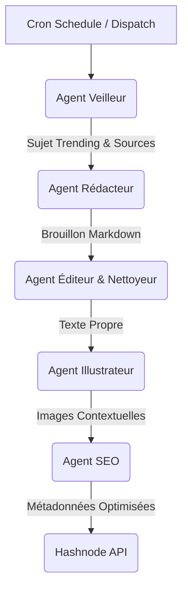

# 🤖 Automated Engineering Blog Generator

Ce projet est un pipeline CI/CD autonome (`Zero-Touch`) qui génère, illustre et publie des articles techniques de haute qualité sur un blog Hashnode. Il combine la puissance des LLM multimodaux (Gemini 2.0 Flash) et des modèles de génération d'images (Flux via Pollinations) pour maintenir un média technologique sans intervention humaine quotidienne.

> **URL du Blog :** [https://remacle.hashnode.dev](https://remacle.hashnode.dev)

-----

## 🏗 Architecture du Système

Le projet repose sur une architecture "Event-Driven" pilotée par GitHub Actions. Il ne s'agit pas d'un simple script monolithique, mais d'une orchestration de plusieurs **Agents Spécialisés** qui interagissent séquentiellement.



### Stack Technique

  * **Orchestration :** GitHub Actions (Cron Jobs)
  * **Core Logic :** Python 3.x
  * **LLM (Cerveau) :** Google Gemini 2.0 Flash (via `google-genai` SDK v2)
  * **Image Gen :** Pollinations.ai (Modèle `flux-realism`)
  * **CMS :** Hashnode (GraphQL API)
  * **Scraping/Parsing :** `BeautifulSoup4`, `Feedparser`

-----

## 🧠 Défis Techniques & Solutions d'Ingénierie

La création d'un blog automatisé pose des problèmes classiques de qualité (hallucinations, répétitions, images incohérentes). Voici comment chaque problème a été résolu par une approche d'ingénierie.

### 1\. Le Problème de la Pertinence ("Garbage In, Garbage Out")

**Défi :** Si l'IA choisit un sujet au hasard, le blog devient inintéressant ou hors-sol.
**Solution : L'Agent Veilleur (RAG Simplifié)**

  * Le script ne "crée" pas de sujets ex-nihilo. Il scrape en temps réel des flux RSS d'autorité (*Hacker News, IEEE Spectrum, Wired*).
  * Il extrait les titres et liens, puis demande à Gemini de sélectionner le sujet le plus "Hard Engineering" du lot.
  * **Résultat :** Le blog colle à l'actualité immédiate (ex: approbation FDA d'un implant 2h après l'annonce).

### 2\. Le Problème de la Qualité Visuelle ("Plastic AI Look")

**Défi :** Les images générées par IA ont souvent un aspect "plastique", des artefacts ou ne correspondent pas au contexte technique.
**Solution : Stratégie Hybride & Prompt Engineering Avancé**

  * **Fallback Réel :** Le script tente d'abord de récupérer l'image officielle (Open Graph) de l'article source. Un "Juge IA" (Gemini Vision) analyse l'image : *"Est-ce un logo pertinent ou une pub ?"*. Si c'est pertinent, on garde le réel (authenticité).
  * **Directeur Artistique Virtuel :** Si l'image réelle est rejetée, l'IA génère un prompt complexe imposant des contraintes physiques (*"Macro photography, f/1.8 aperture, brushed aluminum texture, volumetric lighting"*).
  * **Modèle Flux Realism :** Utilisation spécifique du modèle Flux (via Pollinations) qui gère mieux le texte et la photoréalité que Stable Diffusion classique.

### 3\. Le Problème du Formatage ("Hallucinations Syntaxiques")

**Défi :** Les LLM sont "polis" (*"Voici votre article..."*) et inventent parfois des syntaxes Markdown invalides (*"H2: Titre"* au lieu de `## Titre`), ce qui casse le rendu HTML.
**Solution : Pipeline de Nettoyage à Triple Sécurité**

1.  **Instruction Système (System Prompt) :** Consignes strictes données à l'IA ("Ne sois pas poli, commence direct").
2.  **Agent Correcteur (Self-Reflection) :** Une seconde passe d'IA relit le brouillon pour supprimer les "scories" conversationnelles.
3.  **Nettoyage Déterministe (Regex Python) :** Une fonction finale ("Karcher") utilise des expressions régulières pour forcer brutalement le formatage (suppression des introductions, conversion forcée des titres).

### 4\. Le Problème du Contexte ("L'Image Aveugle")

**Défi :** Insérer des images aléatoirement dans le texte n'a aucun sens.
**Solution : Injection Contextuelle Intelligente**

  * Le script analyse la structure sémantique du texte généré (détection des chapitres `##`).
  * Il insère les images *après* chaque concept technique majeur.
  * Le prompt de l'image est contextuel : *"Génère un schéma technique de [Sujet du Chapitre] dans le contexte de [Sujet de l'Article]"*.

### 5\. Le Problème du Référencement (SEO)

**Défi :** Un article généré n'est pas optimisé pour Google (URL moche, pas de meta description).
**Solution : Agent SEO Dédié**

  * Une fonction spécifique analyse le contenu final pour générer un JSON strict.
  * **Slug :** Nettoyé et normalisé (`implant-cerveau-fda` vs `Article 1`).
  * **Meta Tags :** Génération d'un titre \< 60 caractères et d'une description \< 155 caractères pour le CTR (Click-Through Rate).
  * **Maillage Interne :** Injection automatique de liens vers la page d'accueil et les tags du blog pour retenir les robots d'indexation.

-----

## 🛠 Installation & Configuration

### Prérequis

  * Un compte **Google AI Studio** (Clé API Gemini).
  * Un blog **Hashnode** (Token d'accès personnel).
  * Un repository **GitHub**.

### Variables d'Environnement (GitHub Secrets)

Configurez les secrets suivants dans `Settings > Secrets and variables > Actions` :

| Secret | Description |
| :--- | :--- |
| `GOOGLE_API_KEY` | Clé API pour Gemini 2.0 Flash (Gratuit via AI Studio). |
| `HASHNODE_API_KEY` | Token d'accès personnel Hashnode (dispo dans les Developer Settings). |

### Structure des Fichiers

  * `.github/workflows/blog_bot.yml` : Définit la fréquence d'exécution (CRON).
  * `main.py` : Le cerveau du système (Agents, Logique, API Calls).
  * `requirements.txt` : Dépendances (`google-genai`, `feedparser`, `beautifulsoup4`, etc.).

-----

## 🚀 Utilisation

### Mode Automatique

Le workflow est configuré pour s'exécuter automatiquement (par défaut tous les 3 jours à 9h00) via le fichier YAML :

```yaml
on:
  schedule:
    - cron: '0 9 */3 * *'
```

### Mode Manuel

Pour tester ou forcer une publication :

1.  Allez dans l'onglet **Actions** du repo GitHub.
2.  Sélectionnez le workflow **Engineer Blog Auto-Writer**.
3.  Cliquez sur **Run workflow**.

-----

## 🛡 Disclaimer & Éthique

Ce projet est une démonstration d'ingénierie logicielle appliquée à l'IA Générative.

  * **Transparence :** Les articles sont signés automatiquement pour indiquer leur origine.
  * **Attribution :** Les sources originales (issues du RSS) sont analysées pour garantir la véracité des faits techniques rapportés.

-----

**Auteur :** Nathan Remacle
**Licence :** MIT
